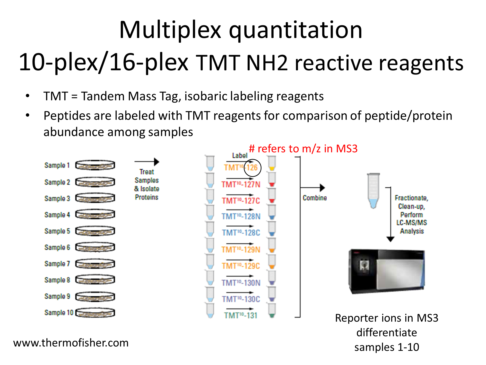
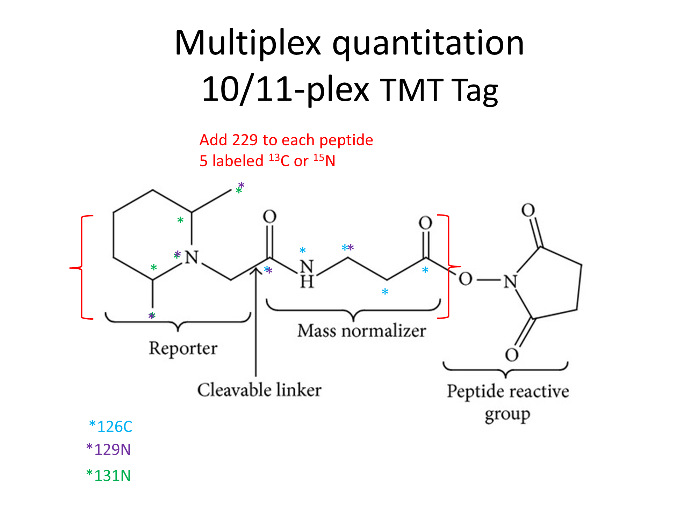
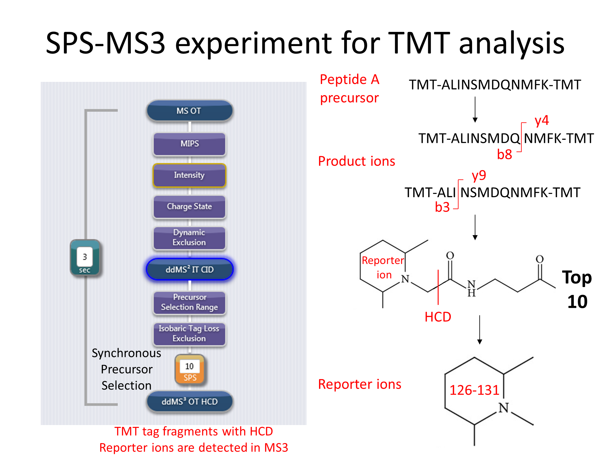

# TMT_overview_2020
### General overview of performing tandem mass tags (TMT) quantitative proteomics experiments.

### prepared by Jennifer Cunliffe
### OHSU Proteomics Shared Resource
### April 21, 2020

***

*Slide 1*  
We perform our quantitative studies using TMT labels, which are isobaric labeling reagents from Thermo. We use the NH2 reactive reagents, which react with N-termini and lysines. The peptides from each sample are labeled with their own unique label; in the above example, all of the peptides in sample 1 are labeled with TMT-126, with the 126 number referring to the m/z of the reporter ion in the third stage of MS (or MS3). All of the labeled peptides, from all of the samples, are combined into one sample and that sample is injected into the LC-MS. Comparing peptides from sample 1-10 is done by the reporter ion readout in MS3.

***

*Slide 2*  
Here is a schematic of the 10/11-plex TMT tag. A N-terminus or lysine attaches to the mass normalizer group. The tags are isobaric, meaning they have the same nominal mass and structure, and therefore a peptide will elute at the same time with the same mass whether it is labeled with 126 or 131. The tags have five heavy atoms that are distributed differently throughout the mass normalizer and reporter groups – see above for the distribution for 126C, 129N and 131N. It is only when the tag undergoes HCD fragmentation before MS3 that the reporter ion breaks off and the peptides can be differentiated by the m/z in MS3.

***

*Slide 3*  

In the PSR core we use a SPS-MS3 method to analyze our TMT samples. In the first stage of MS, precursors are detected in the orbitrap. After meeting certain selection criteria, the precursor is fragmented by collision induced dissociation (CID) in the ion trap (IT, in MS2), producing product ions. The b ions are always TMT tagged, and the y-ions are only TMT tagged if the C-terminal residue is lysine. From there, the top 10 ions are sent to the ion routing multipole (IRM) where they undergo higher energy collisional dissociation (HCD), which fragments the TMT tag releasing the reporter ions into the orbitrap for eventual detection.

***

*Slide 4*  
The top trace shows a total ion chromatogram (TIC), or all of the ions being detected over time. Let’s say Peptide A elutes at 32.5 min. The precursor is sent to the ion trap for MS2, producing product ions (y and b ions).

***

*Slide 5*  
The top 10 y and b ions from MS2 are sent to the IRM, where they undergo HCD, and the reporter ions (from all 10 y/b ions) are sent to the orbitrap for MS3 detection. The mass resolution in the orbitrap is set to 60,000, enabling the mass resolution between the N and C TMT tags, which only differs by 6 mDa. In 128N labeled peptides from sample 4 and 128C labeled peptides from sample 5, peptide A is more abundant in sample 5 than in sample 4.

***

*Slide 6*  
The SPS-MS3 method can be used to quantitate at the peptide or protein level. To quantitate at the peptide level, all of the reporter ion intensities from the peptide fragments are summed. To quantitate at the protein level, all of the peptide reporter ion intensities for that protein are summed. Comparisons can be made across the samples, or sample groups, at either the peptide or protein level.

***

*Slide 7*  
A list of peptides and proteins (example shown above) is generated, with the columns separated by sample. At the top under the TMT tag name is a value for TMT reporter ion intensities across all proteins in the sample. This value is used to normalize the samples. The reporter ion intensities are also reported on a protein level. If you look across the samples, you can compare the level of that particular protein.

***

*Slide 8*  
More recently, a 16plex TMT reagent kit has been introduced – named TMTpro. The concept is the same as the 10/11-plex just with different structures and chemistry. The reporter ions have m/z 126 – 134.

***

*Slide 9*  
Above is a schematic of the 16 TMTpro tags.

***

*Slide 10*  
A major advantage of the 16-plex over the 10/11-plex is the opportunity to compare more samples in the same experiment. This becomes especially advantageous when quantifying large numbers of samples across multiple experiments.

***

Thank you!
